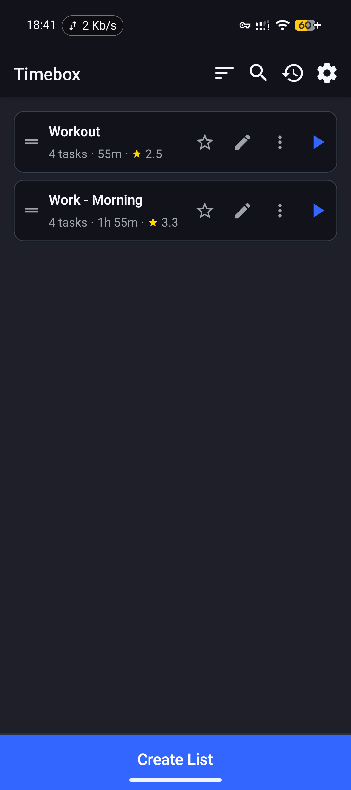
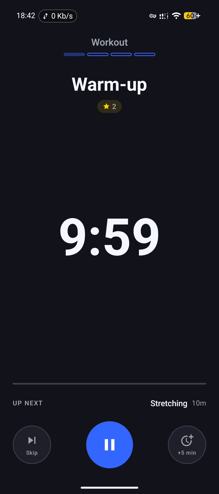
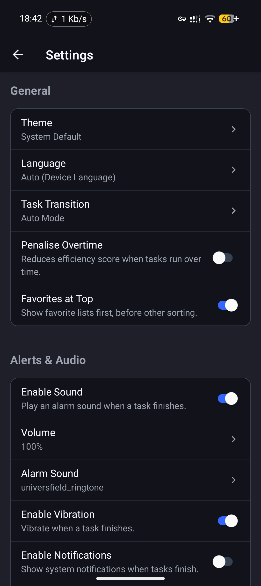
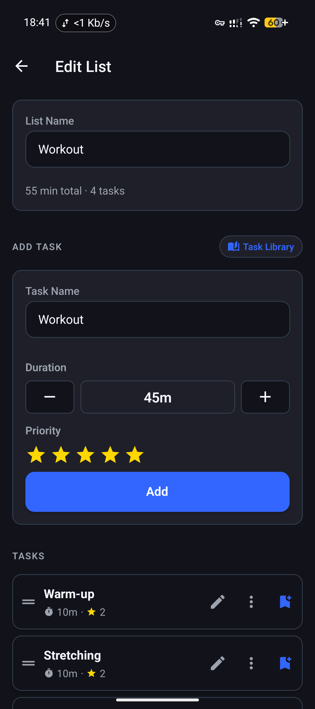
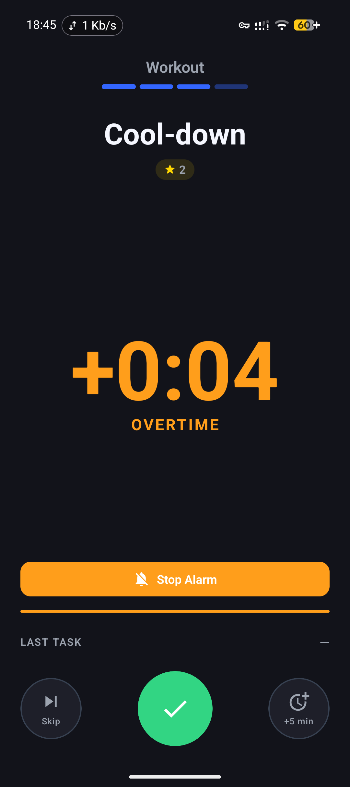

# Timebox

**Stay Focused, One Task at a Time**

A minimal, privacy-first task timer. No ads, no accounts, no tracking — just you and your tasks.

## Features

- **Task Lists** — Create lists with custom durations for each task
- **Focused Sessions** — Run tasks one at a time with clear countdowns
- **History** — Track your completed sessions and productivity
- **Privacy-First** — All data stays on your device, no internet required
- **Dark Mode** — Follows your system theme automatically
- **Multilingual** — Available in English and German

## Screenshots

| Home | Timer | Settings |
|:---:|:---:|:---:|
|  |  |  |

| Lists | Overtime |
|:---:|:---:|
|  |  |

## Download

- **[Latest APK](https://github.com/cdqt/timebox/releases/latest)** — Download from GitHub Releases
- **Obtainium** — Add `cdqt/timebox` to track updates automatically

## Links

- **Website:** [timebox.velres.com](https://timebox.velres.com)
- **Privacy Policy:** [timebox.velres.com/privacy.html](https://timebox.velres.com/privacy.html)

## Contact

Questions or feedback? Reach out at [dev@velres.com](mailto:dev@velres.com).

## Development

This app was built using **AI-assisted development workflows**. The product concept, feature specification, testing, and release management were done manually — the implementation was generated with AI coding assistance.

## License

All rights reserved.
